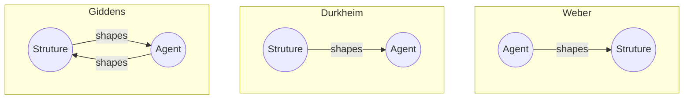

---
{"dg-publish":true,"permalink":"/agent-structure-problem/"}
---

# Agent Structure Problem 

- is a [[Constructivism\|Constructivism]]’s debate of how whether the agent shapes the structure its in or the opposite.

- [[Max Weber\|Max Weber]]: actors are free individuals makes accumulative actions forming into a society
    - Bottom up approach: we look at individual level to understand the upper levels (state & int.)
- [[Emile Durkheim\|Emile Durkheim]]: how members of society is socialized into the social system
    - Actors are structured according to the social rules that exist
    - Up Down approach: social structure determines and shape actors in them
- The debate is hedged or solved by third ‘structuration’ approach: [[Anthony Giddens\|Anthony Giddens]]
    - Neither bottom-up or top-down
    - Actors are shaped by social structures
    - Actors also have some autonomy in shaping the social structures as well
    - It’s a continuous dynamic $\small\boxed{\textsf{Agent}\leftrightarrows \textsf{Structure}}$

# References

Reference:: [[04 Social Constructivism YouTube\|04 Social Constructivism YouTube]]