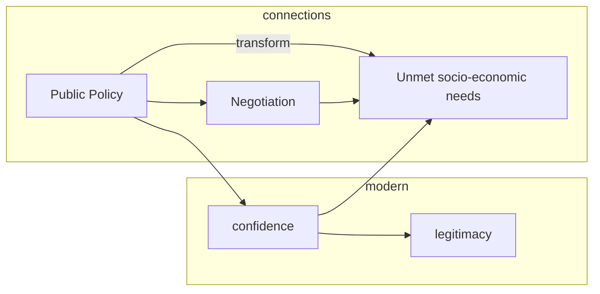

---
{"dg-publish":true,"permalink":"/cmrai-10-facilitation/"}
---

# CMRAI-10: Facilitation

# Introduction

- As a **non-authoritarian and nonjudgmental mode of decision making**, facilitative methods have been applied to a broad set of issues in a wide range of settings from promotion of mutual understanding in a protracted conflict to reconciliation.
- A facilitative process can also be utilized for communal problem solving as well as **creating an opportunity for informal contact** between members of antagonistic communities that might lead to official negotiations.
- This chapter covers procedures which contribute to unfreezing conflict relationships by developing a common understanding of deeper issues that underlie adversarial relationships.

# Features of Facilitation & Dialogue

- In facilitation (designed to tackle militia violence or stop civil war), **group discussion** is designed for a **collective search for problem solving** based on mutual understanding of the issues and sources of problems.
    - such as problem-solving workshops for influential social actors
    - forums for the empowerment of women’s voices for peace
    - an informal conference for the recognition and respect for different cultural traditions.
- Purpose of Facilitation:
    - Facilitated dialogues can support mutual understanding of each other’s concerns
    - building solidarity
    - paving moments of transition
    - helping to develop transformative insights.
    - Facilitation serves as a method of adjusting interaction in an environment conducive to flexible decision making.
- Dialogue and other processes of facilitation differ from negotiation in that it does not involve bargaining processes nor does it promote compromise.
- Various methods of facilitation
    - problem-solving workshops
    - dialogue projects
- Facilitation **rely on the analysis of deep causes** of hostile relationships for the exploration of desirable solutions.
- **The goal of a dialogue** process is to develop a framework to arrive at shared meaning and understanding along with the group ownership of the facilitative process and outcome.

# Facilitating a Group

- Purpose of Facilitation for Conflicting Group
    - The **creation of new understanding** helps cultivate interdependent relationships with a shared future.
    - High assertiveness and competition need to be converted to cooperation by a collaborative process.
- Participants should be able to commit the resources (time, energy, money, and facilities) needed for the process to address, discuss, and resolve issues.
- Trust is gained by a feeling of security and confidence that allows for open, candid discussion between negotiating parties.
- A positive atmosphere of discussion about communal conflict is created by group dynamics based on strong cohesion, goodwill, and morale.
- A **broader set of issues** tends to involve a large number of multiple stakeholders with an even distribution of decision-making power.
- **Can’t be Compromised**: Ethnic, religious, linguistic, and other identity-related issues representing particular communities are not likely to be amenable to compromise.
    - **Existential needs** can be better understood through dialogue or other types of **less formal process** of exchange of views.

# Facilitation and Empowerment

- The core value of facilitation is empowerment by enhancing, in direct and indirect ways, a positive personal, relational, and systemic change.
    - Produce individualistic changes to be more understanding to each other
- Public participation in problem solving is crucial in upholding **democratic ideals as an antidote/remedy to dysfunctional organizations**
    - especially when those in authority are not in touch with the majority of people affected by their decisions (Sidaway, 2005).
- Indeed, constructive dialogue among citizens generates a transformative dynamic, inspiring a vital communal life (needed to adapt to economic, social, or environmental changes).
- Institutions and practices of governance can be improved by increased societal input to solve problems especially in multi-ethnic or multi-racial societies such as Northern Ireland and [[South Africa\|South Africa]].
    - Even if politics is restricted, Environment, social, economic policies should be decided by the people to avoid violence
- Conflict can provide an impetus for growth in human morality if it is resolved in a way to eliminate political oppression and economic inequities
    
    
    💡 Ex: apologies and compensation for the indigenous populations in Australia and New Zealand).
    
    
    
- As best illustrated by the Chinese oppression of Tibetans and Uighur Muslims, repression of conflict is intended to conceal unjust relations, while denying the dignity of the oppressed.
- The content and context of conflict resolution can be understood in terms of the adjustment of human institutions to the need for changes in the system of distribution of power and resources.

# Designing a Transformative Process

- By motivating reason, an appropriate expression of affection and emotional support can be complementary to rationality.
- The productive use of emotion stimulates the cognitive processes needed for creative thinking.
- Good questions increase understanding of other viewpoints.
- Participants should be ready to “learn how to think together – not just in the sense of analyzing a shared problem or creating new pieces of shared
knowledge.”
- In comparison with arguments which often lead to polarization, deep listening, discussion, and reflection are intended to discover differences and explore new information and insight.

# Promotion of Participatory Democracy

- In a deliberate effort to improve the quality of participatory democracy, some study circles have developed small group and citywide processes which help everyone’s voice, beliefs, and experiences to be heard.
- These grassroots study circles have been engaged in selfeducation, establishment of new community networks, organization of collaborative projects, and eventual changes in communal decision-making structures.
- Various dialogue forums have designed a process whereby people get together as equal participants to discuss a specific issue.
- At these forums ranging from small study circles to town meetings, a non-adversarial environment has permitted “citizens to take a fresh look at the topic and their own perspectives” by stressing empathetic listening and nonjudgmental attitudes.
- Transformative possibilities stem from uncovering a multiplicity of meanings and mutual understanding of each other’s identity that emerges from interaction.
- Successful dialogue forums have attempted to cultivate social and political capacities to provide input to important communal issues.
- Value conflict needs to be differentiated from the issues of wants and desires.
- Instead of reaching an agreement, a dialogue process needs to “make value differences transparent” while validating diverse perspectives (McCorkle and Reese, 2005, p. 123).

# Diverse Application of Facilitation

| Table 10.1: Types of Facilitation | Setting of application | Facilitation process | Objectives |
| --- | --- | --- | --- |
| Negotiated Rule Making | Public policy disputes | Representation of stakeholder interests | Efficient decision making |
| Community capacity building | Unmet socio-economic needs | Empowerment collaborative decision | Communal development |
| Civil society dialogue | Polarized societal conflict | Promoting mutual understanding | Confidence building |
| Problem-solving workshop | Protracted, often ethnic, conflict | Confidential, analytical | Pre-negotiation initiatives |

# Participatory Process in Community Building

- The concept of human development popularized by the UN Development Program and other UN agencies has focused on capacity building at the grassroots.
- International donors utilized aid meetings to promote joint resource management projects in building bridges in a conflict-torn triangle of the Ferghana Valley region shared by Kyrgyzstan, Tajikistan, and Uzbekistan.
- Despite animosities among the central governments, the local residents have to work together on joint projects of water and forest management.
- Given the political difficulties, international development agencies have served as a main facilitator for community peace building.
- New norms of respect, trust, tolerance, and reciprocity can be developed in handling community disputes.

# Negotiated Rule Making

- Negotiated rule making in a domestic setting has been enacted to prevent policy disputes with the creation of collaborative relationships among multiple stakeholders in developing administrative regulations.
- The process is designed to resolve differences or provide input into policy making by discovering a common ground among participants in a more relaxed non-adversarial environment.
- If it is properly designed, a negotiated rule-making process should be inclusive in terms of the balanced representation or coverage of interests, accountability to constituencies, and the free flow of information.
- Ideally speaking, all phases are open to every interest group (e.g., residents, environmental groups, and businesses) so that the participants retain the control over the outcome.
- While those affected can make moral claims to public sympathy, the agreement can be blocked by those who have political clout.
- Even when the process may be purely local, the issue may attract the attention and participation of national or international stakeholders as secondary participants in a supporting role.
- Financial assistance can provide access to consultants and other needed resources for poorly funded groups.
- National or international advocacy groups can be invited to directly participate in a group process or support smaller, local advocacy groups.

# Dialogue Forums and Process

- In general, dialogue is designed to enhance mutual understanding and induce change in adversarial behavior.
- Dialogue is dubbed both as a diplomatic tool between states and as a means to bring an end to communal violence.
- Regarding human rights issues, consultative meetings between China and the European Union respectively have been held in the hope of bringing about improvement in Beijing’s notorious treatment of political prisoners.
- In addressing concerns with China’s environmental pollution, Germany held bilateral meetings in order to explore technical assistance.
- Forums of dialogue involving small groups or entire communities have also been organized to discuss diverse issues, ranging from specific local resource conflicts to racial and ethnic tensions.
- As part of grassroots peace building, the long-term objective of dialogue is to promote peace “from below” by encouraging collaboration among people who share an interdependent fate.
- A dialogue process can go hand in hand with institution building, networking, and practical projects which generate confidence building.
- Once the initial stage moves on to probing the conflict’s roots, the dialogue process is used to explore and propose alternatives to the current situation (e.g., desirable political system changes).
- Initiatives for peace involve an essential task of building empathy and confidence as well as reframing and conceptualizing the problems.
- The intent of a dialogue “is not to come to consensus over an issue, but to find common ground” by understanding the thought processes of others (Foley, 2003, p. 248).
- Inquiry and learning (based on shared information) facilitate a search for solutions, while encouraging interaction to move forward with greater clarity and depth.
Facilitator Roles: Procedural

# Responsibilities

- Facilitation procedures can be coordinated by someone who is able to offer inputs into a group process with sufficient background information and broad knowledge base.
- Facilitators help a group identify outcomes to achieve
(e.g., action plans to eliminate hate crimes or proposals to curb the harmful effects of water pollution).
- At community meetings involving multiple participants, facilitators may spell out the prohibition of personal attacks as well as attacks on motivations and intentions of participants.
- In keeping the group focused on objectives, a facilitator needs to periodically summarize the group’s progress.

# Facilitator Roles: Procedural Responsibilities

- The guidance by a facilitator can help groups create a positive climate for conversation and identify the main steps needed to move toward the overall goal.
- The impartiality and objectivity of a procedure are essential to the expression of diverse views.
- The process can be constructively managed by information sharing and consultation with constituents.

# Facilitator Skills

- The main job of facilitators is not a leader’s role but is probing, observing, developing rapport with participants (Foley, 2003).
- Facilitators need to have diverse interpretive skills, ranging from listening to rephrasing.
- Facilitators should be able to rephrase concepts without altering their original meanings.
- Openness encourages acknowledging, understanding, and managing emotions.
- Relational skills permit the expression of differences in opinions.
- Trust and confidence can be derived from empathetic listening that enables speakers to talk through their own problem and feelings (McCorkle and Reese, 2005).
- Process skills entail properly sensing the flow of interaction as well as developing common meanings from different perspectives.
- When emotions get into a negative spiral, it is time to break off discussion to have time to let the tension subside.
- Diverse techniques to interrupt the cycle of provocation and reduce the impact of emotion on discussion involve acknowledging feelings as well as withdrawal from discussion.
- Facilitators can urge the participants to put themselves in the other’s shoes for greater openness with more flexibility in attitudes and goals.
Conditions for Successful Facilitation
- What is most desired at the end of facilitation is the emergence of trust and respect because facilitation is not likely to “produce immediate solutions to all problems”.
- Productive facilitation would not take place without a conducive environment that has a positive impact on the participants’ perceptions.
- The psychologically and physically flexible atmosphere helps communication be free of bias as much as possible.
- The agenda needs to be balanced to cover the full range of issues which represent all key interests.
- Seeking a balance in the power situation is necessary to boost the capacity of participants for full expression of their views so that any power differential would not inhibit the exchange of views.

# Public Peace Process: the Role of Dialogue

- Grassroots peace-building initiatives shed light on interacting constructively with one another, eventually leading to institutional, network building (inter-ethnic advisory boards, NGO networks).
- Dialogue (i.e., confidential problem-solving workshops) is utilized as a pre-negotiation to inspire official negotiations.
- In fostering empathy, group encounters supported by face-toface communication promote personal confidence building.
- A series of dialogue events (in protracted conflicts) are designed to reveal underlying needs and fears as well as values.
- National forums have also been used either to supplement or support a negotiation process to end civil wars or to develop a framework for political transition (e.g., [[South Africa\|South Africa]]).
- In post-conflict settings, a dialogue process was adopted to discuss constitutional changes in Ethiopia, Somalia, and Afghanistan.
Informal, Nonofficial Communication:

# Track II Diplomacy

- In general, official government actions (equated to track I) are distinguished from unofficial efforts by nongovernmental professionals called track II.
- As official representatives are engaged in formal interaction based on government instructions, track I official diplomacy is likely to be constrained by power politics.
- On the contrary, track II relies on nongovernmental, informal, unofficial interaction between private citizens for the exploration of security and esteem of each other, bypassing the formal government power structure.
- In general, informal confidence-building processes invite multiple groups to diverse settings of contact and exchange, ranging from scholarly meetings to communal development.
Informal, Nonofficial Communication:
- As a parallel process, track II is not a substitute for but is rather complementary to track I.
- In fact, tracks I and II are often interconnected to each other.
- Indeed, nonofficial track II diplomacy focuses on understanding and communication through direct encounters.
- Its main function is the education of the public in creating a safe political environment for leaders to negotiate, but immediate success depends on effectiveness in changing the perceptions of influential policy makers.
- People in the media, business, and other sectors across states can be engaged in promoting intercultural understanding.

# Deeper Communication: A Problem-Solving Workshop

- In identifying and understanding each other’s needs, parties should analyze the causes of conflict and examine conditions for its resolution.
- New information about root causes of conflict gained in the analytical process should give participants an opportunity to alter their perceptions about the conflict and their adversaries.
- Problem-solving workshops seek mutual understanding of security and other ontological issues which contribute to the deep polarization of positions between parties.
- An academically based, unofficial third-party approach is manifested particularly in problem-solving workshops.
- Representatives of community members are brought together for communication in interactive problem solving.
- Initially, a small group of expert panelists guide the participants to analyze the causes of conflict and examine conditions for its resolution.
- In the process of analyzing the root causes of contentious relationships, adversarial group members can develop sufficient knowledge of the sources of conflict (often associated with suppressed basic human needs).
- The main task of the workshop is not bargaining different interests but conceptualizing conflict relationships through the analysis of the parties’ needs.
- In order to transform conflict embedded in long-term hostilities, parties have to be willing to change the patterns of their interactions that may entail the need for structural changes.

# Relationship Transformation

- The initial stage of conflict-resolution workshops needs to be oriented toward overcoming demonized enemy images of each other because mutually hostile perceptions are an obstacle to collaboration on the projects of common interests.
- The main assumption of the workshop is that the eventual transformation of relationships between longterm adversaries is a precondition for overcoming a history of intense hostilities.
- The immediate goal of a workshop is to generate a learning process with the injection of new knowledge and information through informal meetings.
- Yet its ultimate objective is to provide a positive input to an official negotiation process.
Workshop Process and Dynamics
- The workshop’s goal can be best achieved by selecting participants in a position to politically influence their respective communities.
- However, they do not need to be directly responsible for policy making, while their active and credible role in the political debate is necessary to bring about a change in the political environment (Kelman, 2002).
- The credibility and legitimacy of facilitators come from their academic credentials.
- The input provided by expert panelists consists of general theories about human behavior applicable to a particular conflict.

# Workshop Process and Dynamics

- The collaborative process is necessary to form new ideas, perceptions, and attitudes (Burton, 1997).
- Workshop proceedings can be designed to examine the impact of each community’s action on the other side by utilizing role plays.
- Parties to a problem-solving exercise should be able to develop a common frame which helps interpret and evaluate their opponent’s role in a more acceptable term.
- Indeed, continuing meetings can result in further development of a temporary frame into a shared belief which produces a collapse of categories, eventually redefining the opponents as partners.