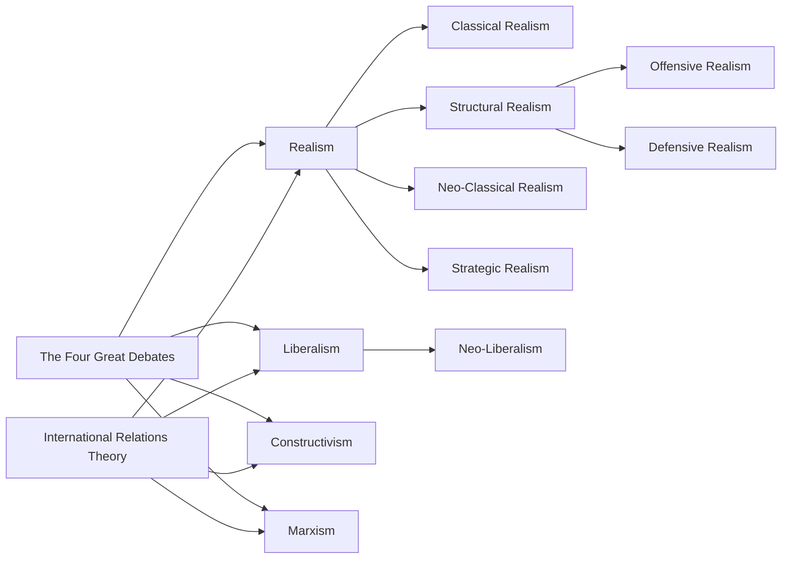

---
{"dg-publish":true,"permalink":"/irt/","tags":["IR-Theory","MOC"]}
---

children: [[Realism\|Realism]], [[Liberalism\|Liberalism]], [[Constructivism\|Constructivism]], [[Marxism\|Marxism]]
# International Relations Theory (IRT)

# Traditional IRTs

- [[Realism\|Realism]]: the oldest way of describing international relations as anarchic, selfish, power-seeking, and uncooperative.
    - [[Thomas Hobbes\|Thomas Hobbes]]: proposed anarchy and ‘social contracts’ between ruler and the people (state). There is no global sovereign is why there is more war than peace. [^1]
    - [[Hans Morgenthau\|Hans Morgenthau]]: politics is about domination not cooperation
- [[Liberalism\|Liberalism]]: idealistic or optimistic view on IR being cooperative through mutual benefits.
    - [[Immanuel Kant\|Immanuel Kant]]’s ideas outlined [[Democratic Peace Theory\|Democratic Peace Theory]] [^1]
    - [[Woodrow Wilson\|Woodrow Wilson]]’s 14 points plan for a ‘postwar world’ and [[League of Nations\|League of Nations]] [^1]

# [[Modernism\|Modernism]] IRTs

>[!question|right] 💡 [[How does Realism and Neo-Liberalism view international order differently Whats the alternative\|How does Realism and Neo-Liberalism view international order differently Whats the alternative]]
- [[Neo-Liberalism\|Neo-Liberalism]]: taking on basic Realist assumptions, but insisting cooperation is possible through institutions.
- [[Structural Realism\|Structural Realism]] | Neo-Realism:
    - [[Defensive Realism\|Defensive Realism]]: states seek power for security and survival by maintaining moderate and reserved policies, it’s unwise to maximize power as others will punish you
    - [[Offensive Realism\|Offensive Realism]]: the nature of the international system makes system act in an offensive way to maximize power or gain hegemony for survival.

# The Middle Ground IRTs

- [[Constructivism\|Constructivism]]: a middle ground between traditional IRTs and Critical Theories
    - It stress importance of values and shared interests between individuals who interact on the global stage in representation of states.
    - It studies the process of change in norms and ideas.
    - Anarchy can be subjectively interpreted or even change over time if everyone accepted a new system.  [^1]
    - [[Alexander Wendt\|Alexander Wendt]]
- [[English School\|English School]] | International Society: a middle ground between Realism and Liberalism: states existing at the international level as an ‘anarchical society’ through shared norms and expected behaviors  [^1]
# [[Critical Theory\|Critical Theory]] Opposing Traditional IRTs

## Economic Exploitation

- [[Post-Colonialism\|Post-Colonialism]]: exploitation and racism from past colonial masters on ex-colonies.
- [[Marxism\|Marxism]]: economic exploitation on the national level between the rich class (bourgeoisie) and the poor class (proletariat).
    - [[Karl Marx\|Karl Marx]]
- [[Dependency Theory\|Dependency Theory]]: economic exploitation between rich (core) states and poor (periphery) states still goes on today.

## Gender Oppression

- [[Feminism\|Feminism]]: studies why IR or leaders are all men. How is masculinity imposed on IR?

## Questions Fundamental Truths of Traditional Theories

>[!question|right] Where does [[IPE\|IPE]] fit?
- [[Post-Structuralism\|Post-Structuralism]]: challenges ‘fundamental truths’ held by traditional IRTs such as existance of ‘state’, why the state exists – and who it exists for [^1]
- Critical-[[Constructivism\|Constructivism]]?

### All IR-Theory Tags
| File                                                          | tags                                    |
| ------------------------------------------------------------- | --------------------------------------- |
| [[templates/new.IRTheory\|new.IRTheory]]                   | IR-Theory                               |
| [[Structural Realism\|Structural Realism]]                 | IR-Theory, Realism                      |
| [[Structural Marxism\|Structural Marxism]]                 | \-                                      |
| [[Strategic Realism\|Strategic Realism]]                   | IR-Theory                               |
| [[Sociological Liberalism\|Sociological Liberalism]]       | IR-Theory                               |
| [[Socialism\|Socialism]]                                   | IR-Theory, Socialism                    |
| [[Social Constructivism\|Social Constructivism]]           | IR-Theory                               |
| [[Republican Liberalism\|Republican Liberalism]]           | IR-Theory                               |
| [[Realist Institutionalism\|Realist Institutionalism]]     | \-                                      |
| [[Realism\|Realism]]                                       | \-                                      |
| [[Rational Choice Theory\|Rational Choice Theory]]         | Concept, IR-Theory, Realism             |
| [[Post-Structuralism\|Post-Structuralism]]                 | \-                                      |
| [[Post-Modernism\|Post-Modernism]]                         | \-                                      |
| [[Post-Marxism\|Post-Marxism]]                             | \-                                      |
| [[Post-Colonialism\|Post-Colonialism]]                     | IR-Theory                               |
| [[Peace Studies\|Peace Studies]]                           | \-                                      |
| [[Offensive Realism\|Offensive Realism]]                   | IR-Theory, Realism                      |
| [[Neo-Marxism\|Neo-Marxism]]                               | IR-Theory, Marxism                      |
| [[Neo-Classical Realism\|Neo-Classical Realism]]           | IR-Theory                               |
| [[Modernism\|Modernism]]                                   | \-                                      |
| [[Marxism\|Marxism]]                                       | IR-Theory, Marxism                      |
| [[Liberalism\|Liberalism]]                                 | IR-Theory, Liberalism                   |
| [[IRT\|IRT]]                                               | <ul><li>IR-Theory</li><li>MOC</li></ul> |
| [[IPE\|IPE]]                                               | IR-Theory                               |
| [[Interdependence Liberalism\|Interdependence Liberalism]] | IR-Theory                               |
| [[Institutional Liberalism\|Institutional Liberalism]]     | IR-Theory                               |
| [[Feminism\|Feminism]]                                     | IR-Theory                               |
| [[Fascism\|Fascism]]                                       | IR-Theory, Ideology                     |
| [[English School\|English School]]                         | IR-Theory                               |
| [[Deterrence\|Deterrence]]                                 | IR-Theory, Concept, Conflict-Management |
| [[Dependency Theory\|Dependency Theory]]                   | IR-Theory                               |
| [[Defensive Realism\|Defensive Realism]]                   | IR-Theory, NEED-RESEARCH, Realism       |
| [[Critical Security Studies\|Critical Security Studies]]   | \-                                      |
| [[Constructivism\|Constructivism]]                         | IR-Theory                               |
| [[Conservatism\|Conservatism]]                             | IR-Theory                               |
| [[Complex Interdependence\|Complex Interdependence]]       | IR-Theory                               |
| [[Communism\|Communism]]                                   | \-                                      |
| [[Classical Realism\|Classical Realism]]                   | IR-Theory                               |
| [[Anarchy\|Anarchy]]                                       | \-                                      |

{ .block-language-dataview}
# References

[^1]: [International Relations Theories | E-International Relations](https://www.e-ir.info/2017/01/09/international-relations-theory/): used to compile this list in the correct heading and sub-headings

