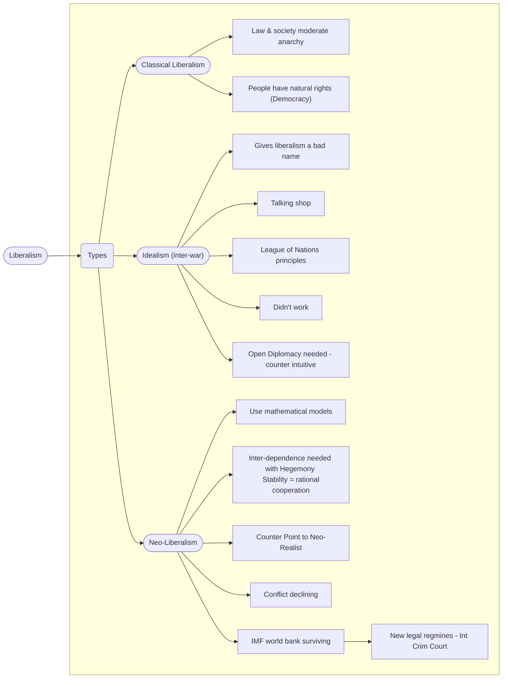

---
{"dg-publish":true,"permalink":"/liberalism/","tags":["IR-Theory","Liberalism"]}
---

# Liberalism

## Assumptions

Injustice, aggression, and war can be eliminated through collective/multilateral actions and institutional reform.

The core belief of liberalism are

- The human nature is rational and good
- States are cooperative
- International System is peaceful and cooperative
- There's always further progress for individuals and international relations between states to grow [^1][^2]
- Individuals share **mutual interests** and will cooperate for mutual benefits [^2]
- human behaviors is malleable and perfectible through institution without aggression

## 4 Basic Principles of Ideal Liberalism [^2]

- Citizens' [Legal Equality](https://en.wikipedia.org/wiki/Equality_before_the_law), Civic Rights: Freedom of religion, free speech
- Sovereignty of state upholding civic rights without influence from Monarch or Military in foreign Policy
- Recognition of rights of Private Property
- The economy is shaped by supply and demand without strict control by governments

# Branches of Liberalism

- [[Neo-Liberalism\|Neo-Liberalism]]

# Sub-Topics to Liberalism

- [[Liberalism Historical Development\|Liberalism Historical Development]]
- [[Liberalism Why Cooperation Will Grow\|Liberalism Why Cooperation Will Grow]]
- [[Theoretical Perspectives on Religion\|Theoretical Perspectives on Religion]]
- [[Theoretical Perspectives on International Institutions\|Theoretical Perspectives on International Institutions]]
- [[Theoretical Perspectives on Asia Pacific Security Studies\|Theoretical Perspectives on Asia Pacific Security Studies]]
- [[The Four Great Debates in IR\|The Four Great Debates in IR]]

# References

[^1]: [[Chapter 2 The Theoretical Foundation of Global Governance\|Chapter 2 The Theoretical Foundation of Global Governance]] (main)
[^2]: [[Jackson(2013)IntroductionInternationalRelationsa Chapter 4 Liberalism\|Jackson(2013)IntroductionInternationalRelationsa Chapter 4 Liberalism]]
